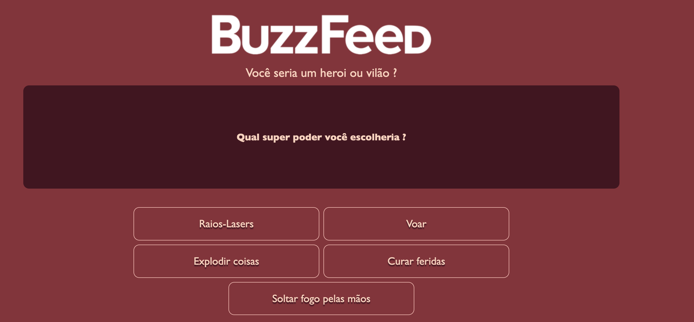

  <header>
    <h1>📚 Angular BuzzFeed Clone</h1>
    
Seja bem-vindo(a) ao meu projeto! 
    Este é um clone simples da BuzzFeed desenvolvido com Angular, com o objetivo de praticar conceitos de front-end moderno e componentização.

  </header>
 
  <main>
    <section>
      <h2>🚀 Tecnologias utilizadas</h2>
      <ul>
        <li>Angular</li>
        <li>TypeScript</li>
        <li>HTML5</li>
        <li>SCSS (ou CSS)</li>
        <li>Angular CLI</li>
      </ul>
    </section>
 
    <section>
      <h2>🎯 Objetivo do projeto</h2>
      
O projeto visa reproduzir a estrutura de um site estilo BuzzFeed, focando no desenvolvimento de componentes reutilizáveis, integração de estilos modernos e simulação de uma experiência de navegação dinâmica.

    </section>
 
    <section>
      <h2>📸 Preview</h2>
      
    </section>
 
    <section>
      <h2>⚙️ Como rodar o projeto</h2>
      <ol>
        <li>Clone o repositório:
          <pre><code>git clone https://github.com/viannaingrid/angular-buzzfeed.git</code></pre>
        </li>
        <li>Acesse a pasta do projeto:
          <pre><code>cd angular-buzzfeed</code></pre>
        </li>
        <li>Instale as dependências:
          <pre><code>npm install</code></pre>
        </li>
        <li>Rode o projeto localmente:
          <pre><code>ng serve</code></pre>
        </li>
        <li>Acesse no navegador:
          <pre><code>http://localhost:4200</code></pre>
        </li>
      </ol>
      
A aplicação recarregará automaticamente se você alterar qualquer um dos arquivos-fonte.

    </section>
 
    <section>
      <h2>🛠️ Comandos úteis</h2>
      <ul>
        <li>Gerar um novo componente:
          <pre><code>ng generate component nome-do-componente</code></pre>
        </li>
        <li>Gerar diretivas, pipes, serviços, classes, guards, interfaces, enums e módulos:
          <pre><code>ng generate directive|pipe|service|class|guard|interface|enum|module</code></pre>
        </li>
        <li>Construir o projeto:
          <pre><code>ng build</code></pre>
        </li>
        <li>Executar testes unitários:
          <pre><code>ng test</code></pre>
        </li>
        <li>Executar testes end-to-end:
          <pre><code>ng e2e</code></pre>
        </li>
      </ul>
    </section>
 
    <section>
      <h2>📚 Ajuda adicional</h2>
      
Para obter mais ajuda sobre o Angular CLI, utilize:

      <pre><code>ng help</code></pre>
      
Ou consulte a documentação oficial: 
        <a href="https://angular.io/cli" target="_blank">Angular CLI Overview and Command Reference</a>
      

    </section>
 
    <section>
      <h2>📌 Funcionalidades</h2>
      <ul>
        <li>Estrutura de layout semelhante ao BuzzFeed</li>
        <li>Componentização utilizando Angular</li>
        <li>Estilização responsiva</li>
        <li>Navegação básica entre seções</li>
      </ul>
    </section>
 
    <section>
      <h2>💡 Melhorias futuras</h2>
      <ul>
        <li>Implementar consumo de API para conteúdo dinâmico</li>
        <li>Adicionar sistema de comentários</li>
        <li>Criar sistema de curtidas e compartilhamento</li>
      </ul>
    </section>
 
    <section>
      <h2>🧑‍💻 Autora</h2>
      
Feito com 💛 por <strong>Ingrid Vianna Oliveira</strong>

    </section>
  </main>
 
  <footer>
    
&copy; 2025 - Desenvolvido por Ingrid Vianna Oliveira

  </footer>